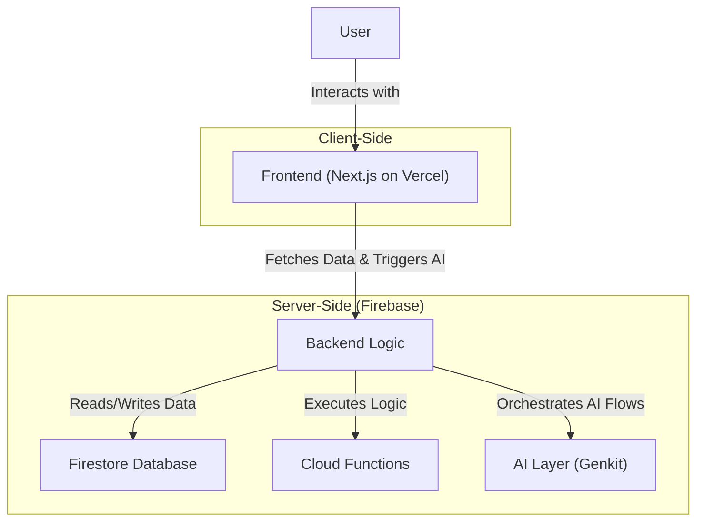
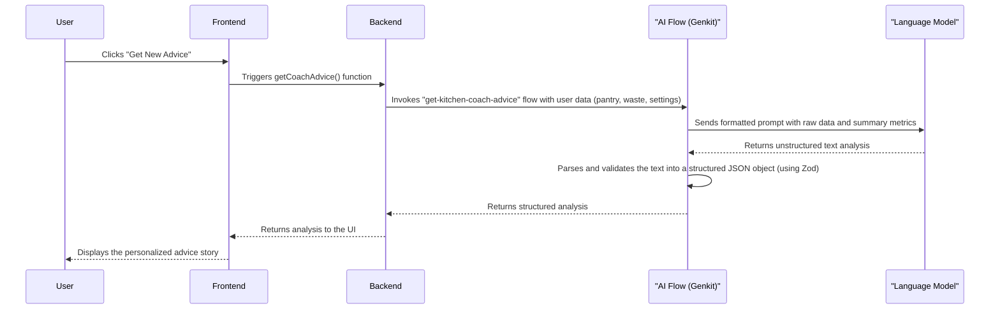
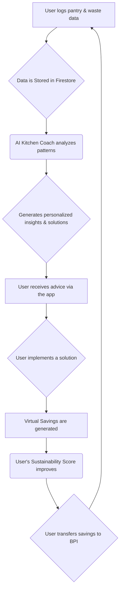

# Scrapeless: Product Requirements Document (PRD)

## 1. Overview

Scrapless is an AI-powered financial management platform designed to tackle one of the most significant hidden costs in every household: food waste. It reframes kitchen management as a financial activity, empowering users to see, understand, and reduce the money they lose to spoilage and inefficient consumption. By meticulously tracking the monetary value of every food item—from purchase to consumption or disposal—Scrapless provides a clear, real-time view of your "food finances."

The application goes beyond simple tracking. It provides powerful analytics to visualize the financial impact of waste and leverages AI to offer actionable solutions, from intelligent recipe suggestions to optimized shopping lists. Most importantly, Scrapless makes saving money a rewarding experience. The platform's core "Virtual Savings" system quantifies the money saved through positive actions, turning waste reduction into a tangible financial gain that users can transfer to their actual bank accounts through our BPI integration. Scrapless is not just about saving the planet; it's about saving your wallet.

## 2. Target Audience

Our target users can be defined by their primary motivation and their stage in the journey toward financial and sustainable mastery. The app, particularly the AI Kitchen Coach, is designed to guide them from "new user" to "advanced user."

*   **The Financially-Minded Saver:** This user's primary goal is to cut costs and save money. They see food waste as a direct financial loss. They are motivated by seeing their Virtual Savings grow and successfully transferring that money to their bank account.
*   **The Eco-Conscious Optimizer:** This user is driven by a desire to live more sustainably. While they care about the environment, they understand that reducing waste also has a significant financial benefit. They are motivated by reducing their carbon footprint and improving their Sustainability Score.
*   **The Busy Household Manager:** This user, often a parent or a working professional, values time and convenience. They are a parent or a working professional, values time and convenience. They are looking for a system to simplify meal planning and grocery shopping. They are motivated by features that reduce mental load, like the AI-powered shopping list and recipe suggestions, which in turn save them money and reduce waste.

## 3. User Problems & Solutions

Our users face common but often invisible financial drains in their kitchen. Scrapless provides tangible, AI-powered solutions to each problem.

| User's Financial Pain Point | The Scrapless Solution & Financial Outcome |
| :--- | :--- |
| **"My grocery bill is high, but I still end up throwing food away. I feel like I'm losing money twice."** | **Financial Waste Audits:** Log what you waste to see exactly how much money is leaving your wallet. The app's analytics provide a clear "profit and loss" statement for your kitchen, with AI insights to plug the financial leaks. |
| **"I buy ingredients for a recipe but don't know how to use the leftovers. It's a sunk cost."** | **Ingredient ROI Maximizer:** The AI suggests recipes based on what's *already in your pantry*, turning sunk costs into delicious meals. This directly converts at-risk items into Virtual Savings, maximizing the return on your grocery investment. |
| **"I want to save money, but I can't see the direct impact of my efforts. It's hard to stay motivated."** | **Tangible, Real-Time Savings:** The Virtual Savings system makes your financial wins visible and instant. When you save an item from being wasted, you see its full monetary value added to your balance, which you can then transfer to your BPI account. |
| **"I feel like I'm stuck in a rut of wasting the same things, but I don't know how to change my habits."** | **Personalized Financial Coaching:** The AI Kitchen Coach acts as your personal financial advisor for food. It analyzes your unique spending and waste patterns to provide tailored, actionable solutions with clear, estimated savings, guiding you from simple habits to advanced optimization strategies. |
| **"Meal planning and creating a shopping list takes too much time and effort. I often give up and just buy what looks good."** | **Automated Financial Planning:** The AI-generated meal plans and smart shopping lists act as your automated financial plan for groceries. By building a list based on what you already own and what you need, it prevents impulse buys and duplicate purchases, directly cutting your grocery bill. |

## 4. Key Features

### 4.1. Dashboard

The Dashboard is the user's central hub, providing an at-a-glance view of their impact, quick access to core features, and actionable insights.

*   **User Impact Card:** A prominent card at the top displaying key metrics:
    *   **Total Virtual Savings:** The monetary value of food saved.
    *   **Carbon Footprint:** The estimated CO2 equivalent (in kg) of the user's food waste.
    *   **Savings Goal:** A progress bar tracking virtual savings transferred to a linked bank account against a user-defined goal.
*   **Quick Actions:** Buttons for the most common tasks:
    *   **Add to Pantry:** A multi-modal input (Camera, Voice, Text) for logging new items.
    *   **Log Food Waste:** A multi-modal input (Camera, Voice, Text) for tracking discarded items.
*   **Waste Breakdown Card:** A visual breakdown of food waste, helping users understand their habits.
*   **Kitchen Coach Panel:** Provides direct access to the AI Kitchen Coach for immediate advice and tips.
*   **Fun Facts Panel:** Shows engaging fun facts and actionable tips based on the user's data to encourage sustainable habits.
*   **Cook & Shop Hub:** A navigation panel that directs users to a dedicated section for recipe generation and smart shopping list creation.
*   **Notifications:** Alerts users about items that are expiring soon.

### 4.2. My Pantry Page

A comprehensive inventory management system that also provides a historical view of food waste.

*   **Tabbed Interface:** Easily switch between two views:
    *   **My Pantry:** A real-time inventory of all food items.
    *   **Waste Bin:** A historical log of all discarded items.
*   **Pantry View:**
    *   **Search and Filter:** Quickly find items by name or filter by status (e.g., "Expiring Soon", "Fresh").
    *   **Item Cards:** Each item is displayed with its name, quantity, and a visual indicator for its freshness status.
    *   **Multi-Modal Add:** Add new items via camera, voice, or text.
    *   **Item Details & Editing:** Click on an item to view, edit, or delete it.
*   **Waste Bin View:**
    *   **Recent Waste History:** A chronological log of all wasted food items.
    *   **Date-Based Filtering:** A calendar interface to view waste logs for specific days.
    *   **Categorized by Time:** Waste entries are grouped by time of day (Morning, Afternoon, Evening).
    *   **Detailed Waste Cards:** Each card shows the item name, time of disposal, reason for waste, monetary value, and carbon footprint.

### 4.3. Analytics Page

A dedicated section for visualizing data and understanding long-term trends in food consumption and waste.

*   **Net Savings/Loss:** A prominent display showing the net financial result of savings versus waste over a selected period.
*   **Waste & Savings Trends:** An interactive area chart that visualizes:
    *   The monetary value of food waste over time.
    *   The monetary value of savings from sustainable actions.
    *   The carbon footprint of waste.
    *   Users can filter the data by timeframe (7, 15, or 30 days) and view it as daily or aggregate data.
*   **Waste Reason Analysis:** A stacked bar chart that breaks down the primary reasons for food waste (e.g., "Spoiled", "Expired") and the food categories associated with each reason.
*   **Pantry Health Score:** A gamified score that provides an at-a-glance understanding of the user's pantry management effectiveness.
*   **Trends & KPIs:** Key Performance Indicators that provide a quick summary of important metrics like waste reduction and savings.
*   **Navigation to Kitchen Coach:** A call-to-action that encourages users to get deeper, AI-powered insights.

### 4.4. Cook & Shop Page

An integrated hub for meal planning and smart grocery shopping, designed to help users utilize their existing pantry items and shop more efficiently.

*   **Tabbed Interface:** Switch between "Recipes" and "Shopping List".
*   **Recipe Suggestions:**
    *   **AI-Powered Generation:** The app automatically suggests recipes based on the items in the user's pantry, with a focus on using ingredients that are expiring soon.
    *   **Recipe Cards:** Each recipe is displayed with a photo, title, and key information. Users can save recipes for later or add them to a meal plan.
    *   **Meal Planner:** A dedicated component to schedule meals for the upcoming week.
*   **Smart Shopping List:**
    *   **AI-Generated List:** Creates a personalized shopping list based on the user's pantry inventory and historical waste patterns.
    *   **Detailed Item Info:** Each suggested item includes the quantity, estimated cost, priority, and the reasoning behind the suggestion.
    *   **Interactive Checklist:** Users can check off items as they shop.
    *   **One-Tap Restock:** (Future Scope) A feature to automatically purchase the shopping list through integrated partners.

### 4.5. Kitchen Coach Page

A personalized AI-powered coach that analyzes the user's data to provide deep insights and actionable solutions for reducing food waste.

*   **On-Demand Analysis:** Users can request a new analysis at any time. The coach processes historical and real-time data on pantry, waste, and savings to generate insights.
*   **The Analysis:** A detailed breakdown of the user's habits, presented in an easy-to-understand narrative format:
    *   **What's Happening:** A summary of the user's current situation.
    *   **The Root Cause:** The underlying reasons for the observed patterns.
    *   **Financial Impact:** The monetary cost of the identified issues.
    *   **Prediction:** A forecast of what will happen if the behavior continues.
*   **Actionable Solutions:**
    *   **Carousel of Solutions:** A horizontally scrollable list of personalized, AI-generated solutions.
    *   **Solution Cards:** Each card presents a specific action the user can take, including the estimated financial savings.
    *   **One-Click Implementation:** Users can commit to trying a solution with a single click, which also logs a savings event in the app.
*   **Quick Wins & Encouragement:** Provides immediate, easy-to-implement tips and motivational messages to keep the user engaged.
*   **Interactive Wizard:** For new analyses, a wizard guides the user through the findings and helps them select their first solution to implement.

## 5. Core Systems & Concepts

### 5.1. AI Chatbot (Scrapless Assistant)

A conversational AI assistant integrated throughout the app to provide on-demand help and guidance.

*   **Personality:** Friendly, encouraging, and uses a natural mix of English and Taglish to be approachable.
*   **Capabilities:**
    *   **Recipe Suggestions:** Offers recipe ideas based on ingredients the user has on hand.
    *   **Expiry Management:** Provides tips on how to store food properly and use items before they expire.
    *   **Waste Pattern Analysis:** Explains the user's waste habits in simple terms.
    *   **Shopping Advice:** Gives suggestions for smarter grocery shopping to prevent future waste.
    *   **Impact Explanations:** Clarifies the environmental and financial impact of the user's actions.

### 5.2. Virtual Savings

Virtual Savings is a core system that translates a user's positive, waste-reducing actions into a tangible monetary value (in PHP). It serves as the primary motivational tool to make the financial benefits of sustainable living visible and rewarding.

*   **How Savings are Generated:** Users accumulate virtual savings by performing specific, high-impact actions that directly prevent food and money from going to waste. The system is designed to be credible and directly linked to user behavior.
    *   **Implementing AI Coach Solutions:** When the Kitchen Coach identifies a recurring, costly waste pattern (e.g., "regularly throwing away spoiled vegetables"), it proposes a targeted solution with a **realistic, pre-calculated savings value** (e.g., ₱150). When the user commits to this solution, this amount is instantly credited to their Virtual Savings. This represents a significant, one-time reward for addressing a core behavioral issue.
    *   **Utilizing At-Risk Pantry Items:** When a user marks a pantry item as "Used" instead of letting it expire and be logged as "Wasted," the app credits the item's **full estimated monetary value** to Virtual Savings. This provides a direct, granular reward for mindful consumption and good inventory management.
    *   **Cooking with AI-Suggested Recipes:** When the user follows an AI-generated recipe designed specifically to use up ingredients that are close to expiring, the **combined value of those saved ingredients** is added to their Virtual Savings upon completion. This incentivizes proactive meal planning and the use of the app's intelligent features.
    *   **Waste Reduction Performance:** The system periodically compares a user's waste in the current period to the previous one. If there is a significant reduction, a portion of that **"waste difference"** is awarded as a virtual saving, directly rewarding the user for their improved performance and positive behavioral change.

*   **Purpose and Impact:**
    *   **Makes Savings Tangible:** It transforms the abstract concept of "money saved from not wasting" into a concrete, visible number that grows with positive actions, providing powerful motivation.
    *   **Direct Financial Feedback:** The system creates a direct feedback loop, showing users the immediate financial upside of their sustainable choices.
    *   **The Bridge to Real-World Value:** Virtual Savings is not just an in-app score. The accumulated balance is the centerpiece of the BPI integration, allowing users to **transfer their virtual earnings to a real BPI bank account**, effectively turning their sustainable habits into real money.

### 5.3. Green Points System

A gamification layer designed to reward user engagement and positive actions within the app.

*   **Earning Points:** Users earn Green Points for activities like:
    *   Logging new items in their pantry.
    *   Consistently tracking their food waste.
    *   Completing waste-free day streaks.
    *   Trying new recipes or implementing coach solutions.
*   **Purpose:** To create a fun and rewarding user experience, encouraging consistent engagement and the formation of long-term sustainable habits.

### 5.4. Green Score (Sustainability Score)

A comprehensive score that provides a holistic measure of a user's sustainability performance, acting as a "credit score" for their food habits.

*   **Score Components:** The score is calculated based on three key pillars:
    *   **Behavioral:** Measures how efficiently you use food. Higher points for using items vs. wasting them.
    *   **Financial:** Reflects your ability to generate savings relative to your waste.
    *   **Engagement:** Rewards consistency, like regular logging and maintaining waste-free streaks.

## 6. User Flow

The typical user journey is designed to guide individuals from initial awareness to becoming financially savvy, waste-conscious power users.

1.  **Onboarding & First Data Input:**
    *   The user signs up using a simple authentication method (e.g., Google, Email).
    *   A brief, engaging onboarding flow introduces the core concepts: "Your kitchen is a financial asset," "Turn saved food into real money," and "Track your progress with a Green Score."
    *   The user is immediately prompted to log their first pantry items, experiencing the ease of the multi-modal (camera, voice, text) input system.

2.  **Habit Formation & Initial Insights:**
    *   The user begins the core loop of logging groceries after shopping and logging any food waste as it occurs.
    *   The Dashboard comes to life, showing their initial waste breakdown, carbon footprint, and the first Green Points earned for engagement.
    *   They receive their first expiry date notifications, creating an initial sense of urgency and awareness.

3.  **Discovering AI-Powered Tools:**
    *   Prompted by an expiring item, the user explores the **Cook & Shop** page.
    *   They use the AI Recipe Generator, successfully cook a meal, and mark the ingredients as "Used." This triggers their first **Virtual Savings** event, demonstrating the app's core value proposition.
    *   They generate their first **Smart Shopping List**, which intelligently suggests items based on their current inventory and past waste patterns. They notice exclusive BPI/Vybe deals on certain items, highlighting potential bonus savings.

4.  **Deepening Understanding with the Kitchen Coach:**
    *   After several weeks of consistent data logging, the user is notified that the **Kitchen Coach** has enough data to provide a deep analysis.
    *   The user requests an analysis and receives a personalized story identifying their primary waste pattern (e.g., "Weekend Over-shopping").
    *   The Coach presents a set of simple, actionable solutions tailored to their "regular_user" status. The user selects a solution like "Plan 2 Meals Before Shopping," which immediately rewards them with a significant Virtual Savings boost.

5.  **Closing the Financial Loop:**
    *   The user's Virtual Savings balance has now grown to a meaningful amount.
    *   They navigate to the **BPI Integration** section and link their BPI #MySaveUp account.
    *   They perform their first transfer, moving money from their Virtual Savings to their real bank account, completing the "waste-to-wealth" journey.
    *   They also explore converting their accumulated Green Points into BPI Rewards.

6.  **Achieving Mastery:**
    *   The user now operates in a seamless cycle of logging, analyzing, and acting. The app is an integral part of their financial and kitchen routine.
    *   They regularly consult the Kitchen Coach, now receiving "Level Up" challenges as an "advanced_user."
    *   Their **Sustainability Score** is high, and they are motivated to maintain it, knowing it reflects their responsible financial and environmental habits and may unlock future benefits.

## 7. Key Metrics & Success Criteria

The success of Scrapless will be measured by its ability to drive user engagement, create tangible financial impact, and successfully integrate with our partners.

### 7.1. User Engagement & Retention
*   **DAU/MAU Ratio:** A measure of the "stickiness" of the app. *Success: > 20%*
*   **D7 Retention:** Percentage of users who return 7 days after their first session. *Success: > 30%*
*   **Core Action Rate:** Percentage of MAU who log at least one pantry item and one waste item per week. *Success: > 50%*
*   **Power User Rate:** Percentage of MAU who use the Kitchen Coach or generate a shopping list. *Success: > 25%*

### 7.2. Financial & Waste Reduction Impact
*   **Average Weekly Waste Reduction:** The average percentage decrease in the monetary value of a user's logged waste after their first 30 days. *Success: > 15%*
*   **Average Net Savings Ratio:** The average user's ratio of `Virtual Savings / Monetary Value of Waste`. *Success: > 1.0*
*   **Sustainability Score Growth:** The average increase in a user's Sustainability Score over their first 60 days. *Success: > 100 points*

### 7.3. BPI Integration Success
*   **BPI Account Linkage Rate:** Percentage of eligible users who successfully link their BPI account. *Success: > 20%*
*   **Virtual Savings Transfer Rate:** Percentage of linked users who transfer savings at least once per quarter. *Success: > 40%*
*   **Average Transfer Amount:** The average monetary value of each transfer. *Success: > ₱500*

## 8. Future Vision & Potential Extensions

Scrapless aims to evolve from a kitchen management tool into a comprehensive platform for sustainable personal finance.

*   **Enhanced AI & Personalization:**
    *   **Predictive Shopping:** AI that automatically forecasts when users will run out of staple items and adds them to a shopping list.
    *   **Automated Pantry Logging:** Utilizing camera vision to automatically detect and log items from a grocery receipt or as they are placed in the refrigerator.
    *   **Dietary & Health Integration:** Suggesting recipes and meal plans based not just on inventory, but also on the user's personal dietary goals (calories, macros, allergies).

*   **Deeper Financial Integration:**
    *   **Eco-Friendly Financial Products:** Partnering with BPI to offer preferential rates on loans or exclusive investment opportunities for users with high Sustainability Scores.
    *   **Grocery Budgeting Tools:** Integrating pantry spending into a broader household budgeting feature within the app.

*   **Community & Social Features:**
    *   **Recipe Sharing Hub:** A community platform for users to share their own waste-reducing recipes and kitchen hacks.
    *   **Community Challenges:** "Zero-Waste Week" competitions with leaderboards and BPI-sponsored rewards.
    *   **Local Food Sharing:** A feature to safely share or trade surplus food items with neighbors to prevent waste at a community level.

*   **Hardware & IoT Integration:**
    *   **Smart Appliance Sync:** Seamlessly integrating with smart refrigerators and ovens to automate inventory management and cooking processes.

## 9. System Architecture

Scrapless is built on a modern, serverless architecture that separates the user interface from the backend logic and AI processing. This design ensures that the app is scalable, secure, and can be developed efficiently.



### 9.1. Frontend (Client-Side)
The user interface is a **Next.js** application written in **TypeScript**. It is responsible for everything the user sees and interacts with.
*   **UI Components:** Built with **Tailwind CSS** and **shadcn/ui** for a clean and responsive design.
*   **State Management:** **Zustand** is used to manage the app's state, such as the list of pantry items or the current user's savings. This makes the UI fast and reactive.
*   **Communication:** The frontend communicates with the backend through a data layer defined in `src/lib/data.ts`. This layer makes calls to Firestore to get data and triggers the AI flows when needed.

### 9.2. Backend (Server-Side on Firebase)
The backend is powered entirely by **Google Firebase**, which provides a scalable, serverless platform.
*   **Data Storage:** All user data (pantry items, waste logs, etc.) is stored in **Firestore**, a flexible NoSQL database.
*   **Business Logic:** **Firebase Cloud Functions** are used for tasks that need to be done on the server, like calculating the "waste difference" for virtual savings or performing complex data aggregations for the analytics page.
*   **Authentication:** **Firebase Authentication** handles all user sign-ups and logins securely.

### 9.3. AI Layer (Genkit)
The intelligence of Scrapless is managed by **Genkit**, an open-source AI framework. It acts as an orchestration layer that connects the user's data to the powerful language models that provide insights.
*   **AI Flows:** Each major AI feature, like the Kitchen Coach advice or the shopping list generation, is defined as a "flow" in the `src/ai/flows` directory.
*   **Data Processing:** A flow takes in user data (e.g., pantry items, waste logs, user settings), formats it into a detailed prompt, sends it to the language model, and then structures the model's response into a predictable format using **Zod schemas**. This ensures the app receives reliable, well-structured data every time.

#### Example AI Flow: Kitchen Coach Analysis
This diagram shows how data moves through the system when a user requests advice from the Kitchen Coach.



## 10. Process Flow & Use-Case Diagrams

These diagrams illustrate how users interact with the Scrapless system and how data flows through its core processes.

### 10.1. Use-Case Diagram
This diagram shows the main actions a user can perform within the Scrapless application.

```mermaid
graph TD
    subgraph Scrapless System
        UC1((Manage Pantry))
        UC2((Log Food Waste))
        UC3((Analyze Performance))
        UC4((Get AI-Powered Guidance))
        UC5((Manage Savings & Rewards))
    end

    User --> UC1
    User --> UC2
    User --> UC3
    User --> UC4
    User --> UC5

    UC4 ..> UC1 : <<includes>>
    UC4 ..> UC5 : <<includes>>
    UC3 ..> UC4 : <<extends>>

```

| Use-Case | Description |
| :--- | :--- |
| **Manage Pantry** | The user adds, edits, and removes items from their digital pantry. They can view the status of all items, including those that are expiring soon. |
| **Log Food Waste** | When food is thrown away, the user logs the item, the reason, and its estimated value. This is the primary input for the financial waste audit. |
| **Analyze Performance** | The user reviews their historical data on the Analytics page, viewing trends in their waste, savings, and overall Sustainability Score. |
| **Get AI-Powered Guidance** | The user interacts with the AI Kitchen Coach to get a deep analysis of their habits and receive personalized solutions. This also includes generating AI-powered recipes and shopping lists. |
| **Manage Savings & Rewards** | The user views their accumulated Virtual Savings and can transfer them to a linked BPI account. They can also convert their Green Points into BPI rewards. |


### 10.2. Core Process Flow: The "Data-to-Savings" Loop
This diagram shows the main process loop within Scrapless. It illustrates how user actions create data, which is then analyzed by the AI to provide insights that lead to actions, resulting in tangible savings.


This loop represents the core value of Scrapless: turning everyday kitchen activities into a continuous cycle of learning, improvement, and financial reward.

## 11. BPI Integration

Scrapless partners with BPI to connect your eco-friendly habits with tangible financial rewards.

*   **Transfer Savings:** Users can transfer their accumulated virtual savings to a BPI #MySaveUp account, turning their good habits into real money.
*   **Sustainability Score:** Your in-app activity contributes to a Sustainability Score, which serves as a testament to your responsible consumption habits. A higher score can a testament to your responsible consumption habits. A higher score can a testament to your responsible consumption habits. A higher score can potentially unlock future eco-friendly financial products and benefits from BPI.
*   **Exclusive Deals:** The AI-powered shopping list highlights special deals and offers from BPI and its partners (e.g., Vybe), providing additional savings opportunities on grocery purchases.
*   **Green Points Conversion:** Users can convert the Green Points earned in the app into BPI rewards points, further integrating their sustainable actions with financial perks.

## 12. Technical Stack

The technology stack for Scrapless was chosen to facilitate rapid development, ensure scalability, and leverage modern AI and cloud capabilities.

*   **Frontend (Next.js with TypeScript):** Next.js provides a powerful React framework that enables a fast, server-rendered user experience. TypeScript ensures type safety and code quality, which is crucial for a data-intensive application.
*   **Styling (Tailwind CSS & shadcn/ui):** Tailwind CSS allows for rapid, utility-first styling, enabling the creation of a custom design system. `shadcn/ui` provides a set of beautifully designed and accessible components that are built on top of Tailwind, accelerating UI development.
*   **State Management (Zustand):** Zustand is a small, fast, and scalable state-management solution. Its simplicity and minimal boilerplate make it ideal for managing the client-side state of the application without unnecessary complexity.
*   **Backend (Firebase):** The Firebase suite provides a robust and scalable serverless backend:
    *   **Firestore:** A NoSQL, cloud-native database for storing all user data, including pantry items, waste logs, and savings events.
    *   **Firebase Authentication:** Handles secure user sign-up and login, supporting various authentication methods.
    *   **Cloud Functions:** Used for server-side logic, such as complex calculations for the Sustainability Score or handling BPI integration webhooks.
*   **AI (Genkit):** The core of our intelligent features is powered by Genkit, an open-source framework from Google that helps orchestrate and manage our AI flows. It allows us to reliably chain prompts, process data, and generate the complex analyses and solutions provided by the Kitchen Coach.
*   **Deployment (Vercel & Firebase Hosting):** The Next.js frontend is deployed on Vercel for optimal performance and seamless integration with the framework. Backend services, including Cloud Functions and Firestore, are hosted on Firebase.

## 13. Implementation

Building Scrapless followed a structured, component-based approach, starting from the foundational design and data layers and moving up to the complex AI and UI features.

1.  **Foundation & Design System:**
    *   The project was initialized as a Next.js application with TypeScript.
    *   Tailwind CSS was integrated for utility-first styling. The core design system, including the color palette (`--primary`, `--destructive`, etc.) and typography, was defined in `src/app/globals.css`.
    *   `shadcn/ui` was used to provide a base library of accessible and reusable components (Buttons, Cards, etc.), which were then customized to match the Scrapless brand.

2.  **Core Data & State Management:**
    *   All primary data structures (`PantryItem`, `WasteLog`, `SavingsEvent`, `GreenPointsEvent`, etc.) were defined in `src/types/index.ts`.
    *   Firestore database rules were established to ensure data security and integrity.
    *   Client-side state management was implemented using Zustand. Separate stores were created for each major data domain (e.g., `pantry-store.ts`, `waste-log-store.ts`, `green-points-store.ts`) to keep the state logic modular and maintainable.

3.  **Component & Page Development:**
    *   With the design system and state management in place, individual UI components were built for each feature (e.g., `PantryItemCard`, `WasteBreakdownCard`).
    *   These components were then assembled into the main pages of the application (Dashboard, Pantry, Analytics, etc.), connecting them to the Zustand stores to display and interact with live data.

4.  **Backend Logic & Firebase Functions:**
    *   Data persistence logic was created in `src/lib/data.ts` to handle all Firestore queries (CRUD operations).
    *   Firebase Cloud Functions were developed to handle more complex backend tasks, such as calculating the periodic "waste difference" for the Virtual Savings system or processing user data for the Kitchen Coach.

5.  **AI Integration with Genkit:**
    *   The AI flows were defined in the `src/ai/flows` directory. Each flow (e.g., `get-coach-advice.ts`, `generate-shopping-list.ts`) was constructed using Genkit, which orchestrates the calls to the underlying language models.
    *   Zod schemas were created in `src/ai/schemas.ts` to define the expected input and output structures for each AI flow, ensuring type-safe and predictable interactions between the frontend and the AI backend.

6.  **BPI Integration & Finalization:**
    *   The final step involved connecting to the (mock) BPI APIs to handle the transfer of Virtual Savings and the conversion of Green Points.
    *   The application was then deployed, with the frontend hosted on Vercel and the backend services running on Firebase.
    
## 14. Development Environment

The development of Scrapless utilized a hybrid approach, leveraging both a powerful web-based IDE and a specialized local IDE to maximize efficiency and collaboration.

*   **Firebase Studio:** This web-based IDE was used for its seamless integration with the project's backend. It provided a convenient way to manage Firestore data, monitor Cloud Functions, and handle deployments directly within a browser-based environment.
*   **Cursor:** The majority of the application's code was written in Cursor, an AI-first local IDE. Its advanced AI capabilities facilitated a "vibe-coding" workflow, enabling rapid prototyping, AI-assisted pair programming, and efficient code generation, which significantly accelerated the development process.
